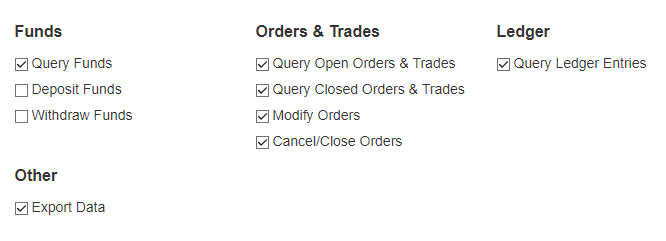

# Berdagang

 

Berdagang is Cryptocurrency trading bot using Python, and using Twitter to tweet it's decision. Currently only support Kraken Exchange. Licensed under MIT License.

# How to use

## Install Dependencies

First, you need to install dependencies from requirements.txt

~~~
pip install -r requirements.txt
~~~

or if you want install each of them manually

~~~
pip install krakenex
pip install tweepy
~~~

## Add your Kraken API key

1. Login to kraken.com using your account, go to Settings > API
2. Click generate new key, and give your key description (like "My trading bot")
3. Please check your key permissions like this: 

4. Then click "Generate Key"
5. Now open file "kraken.key" and insert your key

## Add your Twitter API key

Please note: While you may use your personal account for this, don't do it. Make new twitter account just for your bot.

1. Login to your twitter
2. Make sure your account have phone number verified
3. Go to apps.twitter.com
4. Click create new app
5. Fill the description, and click "Create your Twitter application"
6. Under Permmissions Tab, please make sure you have Read and Write access
7. In "Keys and Access Tokens", click "Create my access token"
8. Open "ngetweet.py", and insert your Twitter API Key

## Edit config.py

Edit pair to choose which trading you want. Please see https://www.kraken.com/help/fees to get the correct name for trading pair. (For example, bitcoin in Kraken are not BTC, but XBT)

~~~python
pair = 'XBTUSD' # Trading Pair name, full list: https://www.kraken.com/help/fees
~~~

Next, you might change how many leverage you will use. 

~~~python
leverage = 5
~~~

Change testing value to 0 so the bot will actualy place order. The default is 1, which mean it always backtest from the chart data.

~~~python
testing = 0
## Config value for testing :
## 0 = Send Trade Order to Kraken, and when it does, tweet it.
## 1 = Backtest using OHLC provided from Kraken
~~~

Theres many other options in config.py, please refer to comment in code when you want to change it.

## Running the bot

This bot is designed to be run every once in a while, like once in a hour. To do this you can use chron job to run it, or if you use Heroku, you can use Heroku Scheduler, set interval you want (for example, 30 minutes) and type following command to run:

~~~
$ python berdagang.py
~~~

# Disclaimer

ALL TRADING INVOLVES HIGH RISK. PAST PERFORMANCE DOES NOT GUARANTEE FUTURE SUCCESS. YOU SHOULD NOT BASE YOUR DECISION ON INVESTING IN ANY TRADING PROGRAM SOLELY ON THE PAST PERFORMANCE PRESENTED. TRADING ON MARGIN INVOLVES HIGH RISK AND IS NOT SUITABLE FOR ALL INVESTORS. THE HIGH DEGREE OF LEVERAGE CAN WORK AGAINST YOU AS WELL AS FOR YOU.